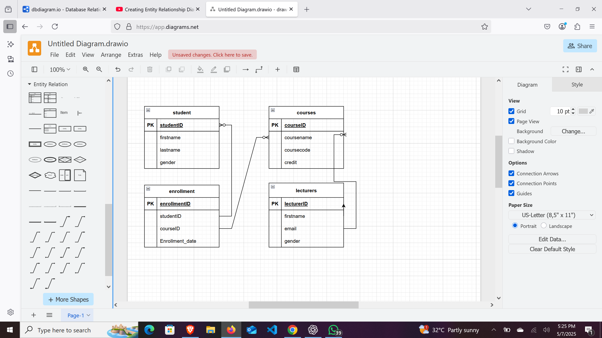

# Student Records Database

## 📘 Description

This project is a simple Student Records Management System created using **MySQL**.  
It includes tables for Students, Courses, Enrollments, and Lecturers with proper relationships.

The system is designed to:

- Store student data
- Manage course information
- Track course enrollment by students
- Assign lecturers to courses

## ⚙️ How to Setup / Run

To use this database:

1. Install [MySQL Server](https://dev.mysql.com/downloads/mysql/)
2. Open your MySQL client (e.g., MySQL Workbench)
3. Import the `answers.sql` file using the **Run SQL Script** option
4. The database and tables will be created automatically

## 🧠 ERD Diagram

Here is the Entity Relationship Diagram used to design the database schema:

